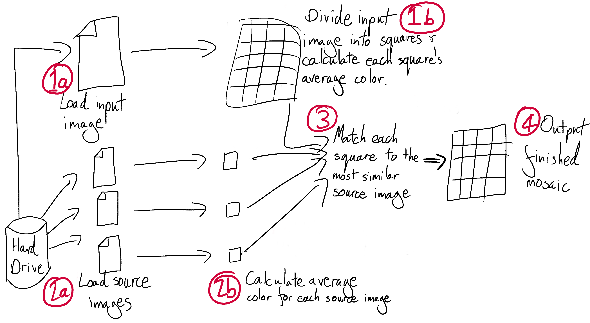

Images are cool but constructing an image from a bunch of source images is even cooler!

<h1 align="center">STEPS</h1>

- [ ] Step 1: Divide input image into square, and calculate average color of each square.
- [ ] Step 2: Create a pixellated output image out of these squares.
- [ ] Step 3: Find 100 source images(the more the better), use batch processing to crop them all into equal squares, save them.
- [ ] Step 4: Calculate the average color of each source image.
- [ ] Step 5: Create an algorithm that maps source images to the input image.
- [ ] Step 6: Construct the output image after mapping algorithm has been implemented
- [ ] Step 7: Pause and congratulate!

## Architecture:

